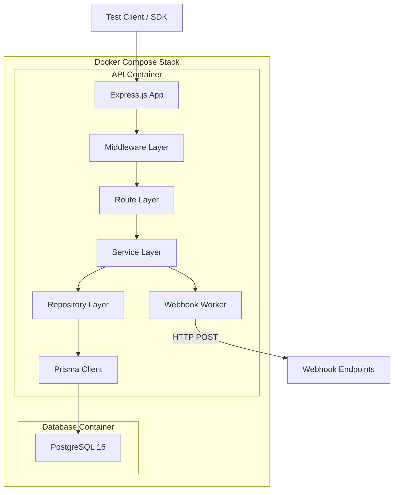
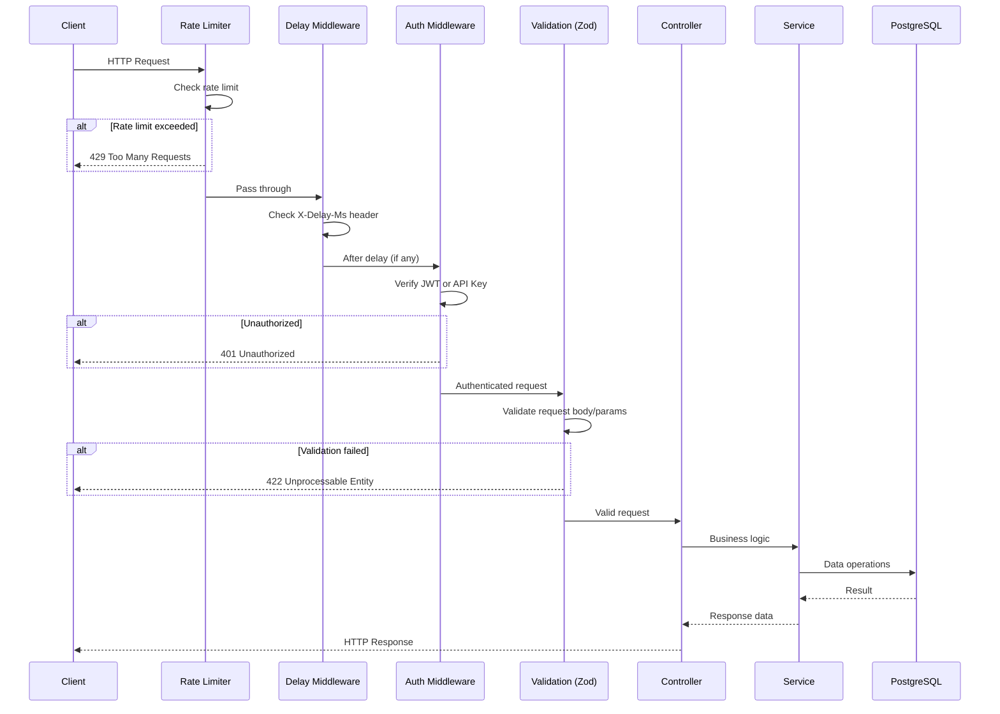
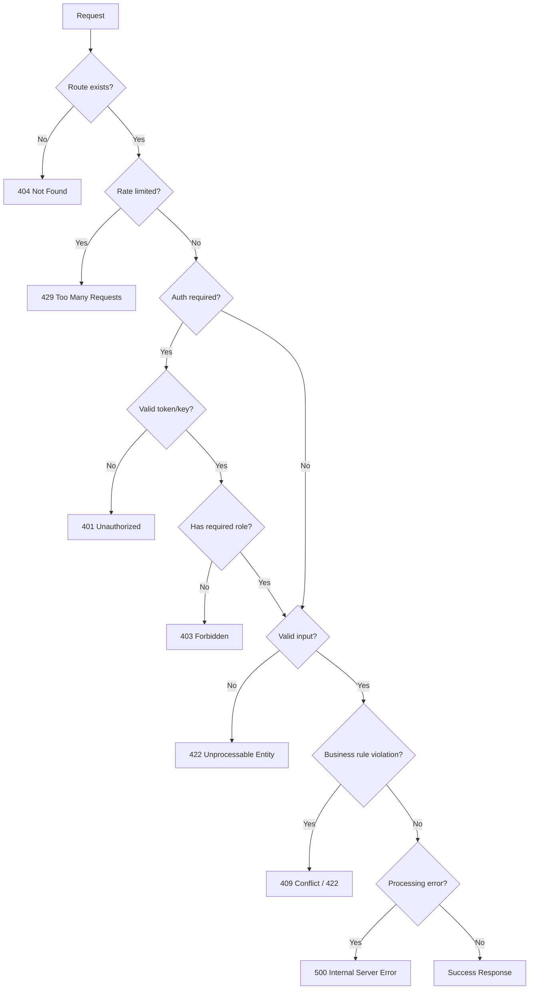
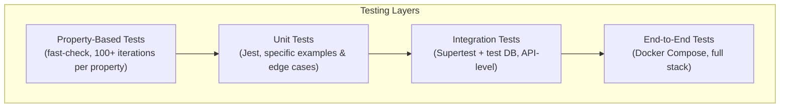

# Design Document: API Testing Backend

## Overview

This design describes a backend API service built as a practice target for automation API testing. The service simulates a financial sector application exposing RESTful endpoints for user management, accounts, transactions, wallets, payment methods, beneficiaries, statements, notifications, webhooks, and file operations.

**Technology Stack:**
- Runtime: Node.js 20 LTS
- Framework: Express.js with TypeScript
- Database: PostgreSQL 16
- ORM: Prisma (type-safe queries, migrations, seeding)
- Authentication: JWT (jsonwebtoken) + bcrypt for password hashing
- Validation: Zod (schema-based request validation)
- Documentation: swagger-jsdoc + swagger-ui-express (OpenAPI 3.0)
- File handling: Multer (multipart uploads)
- PDF generation: PDFKit
- Containerization: Docker + Docker Compose
- CI/CD: GitHub Actions
- SDK: Auto-generated TypeScript client using openapi-typescript-codegen

**Key Design Decisions:**
1. **Prisma over raw SQL** — Provides type-safe database access, automatic migration management, and a built-in seeding mechanism that aligns with Requirement 19.
2. **Zod for validation** — Enables declarative schema definitions that can be reused between request validation and OpenAPI schema generation.
3. **Layered architecture** — Controllers → Services → Repositories pattern separates HTTP concerns from business logic and data access, making the codebase testable and maintainable.
4. **Fixed-window rate limiting with in-memory store** — Simple implementation suitable for a single-instance test target; uses a Map-based store keyed by user ID or IP.
5. **Webhook delivery via async queue** — Uses a simple in-process job queue (bull or a lightweight custom implementation) to handle retries with exponential backoff without blocking request processing.

## Architecture

### High-Level System Architecture



### Request Flow



### Project Structure

```
backend-services/
├── src/
│   ├── app.ts                    # Express app setup
│   ├── server.ts                 # Server entry point
│   ├── config/
│   │   ├── index.ts              # Environment config
│   │   └── database.ts           # Database connection config
│   ├── middleware/
│   │   ├── auth.ts               # JWT + API Key authentication
│   │   ├── rateLimiter.ts        # Rate limiting middleware
│   │   ├── delay.ts              # X-Delay-Ms middleware
│   │   ├── errorHandler.ts       # Global error handler
│   │   ├── pagination.ts         # Pagination parameter parsing
│   │   └── roleGuard.ts         # Role-based access control
│   ├── routes/
│   │   ├── v1/                   # Version 1 routes
│   │   │   ├── index.ts
│   │   │   ├── auth.routes.ts
│   │   │   ├── accounts.routes.ts
│   │   │   ├── transactions.routes.ts
│   │   │   ├── wallets.routes.ts
│   │   │   ├── paymentMethods.routes.ts
│   │   │   ├── beneficiaries.routes.ts
│   │   │   ├── statements.routes.ts
│   │   │   ├── notifications.routes.ts
│   │   │   ├── files.routes.ts
│   │   │   ├── webhooks.routes.ts
│   │   │   ├── bulk.routes.ts
│   │   │   └── test.routes.ts
│   │   └── v2/                   # Version 2 routes
│   │       └── index.ts
│   ├── controllers/
│   │   ├── auth.controller.ts
│   │   ├── accounts.controller.ts
│   │   ├── transactions.controller.ts
│   │   ├── wallets.controller.ts
│   │   ├── paymentMethods.controller.ts
│   │   ├── beneficiaries.controller.ts
│   │   ├── statements.controller.ts
│   │   ├── notifications.controller.ts
│   │   ├── files.controller.ts
│   │   ├── webhooks.controller.ts
│   │   ├── bulk.controller.ts
│   │   └── test.controller.ts
│   ├── services/
│   │   ├── auth.service.ts
│   │   ├── accounts.service.ts
│   │   ├── transactions.service.ts
│   │   ├── wallets.service.ts
│   │   ├── paymentMethods.service.ts
│   │   ├── beneficiaries.service.ts
│   │   ├── statements.service.ts
│   │   ├── notifications.service.ts
│   │   ├── files.service.ts
│   │   ├── webhooks.service.ts
│   │   └── bulk.service.ts
│   ├── validators/
│   │   ├── auth.schema.ts
│   │   ├── accounts.schema.ts
│   │   ├── transactions.schema.ts
│   │   ├── wallets.schema.ts
│   │   ├── paymentMethods.schema.ts
│   │   ├── beneficiaries.schema.ts
│   │   ├── statements.schema.ts
│   │   ├── notifications.schema.ts
│   │   ├── files.schema.ts
│   │   ├── webhooks.schema.ts
│   │   └── bulk.schema.ts
│   ├── utils/
│   │   ├── errors.ts             # Custom error classes
│   │   ├── pagination.ts         # Pagination helpers
│   │   ├── masking.ts            # Sensitive data masking
│   │   └── webhook-delivery.ts   # Webhook delivery with retries
│   └── types/
│       └── index.ts              # Shared TypeScript types
├── prisma/
│   ├── schema.prisma             # Database schema
│   ├── migrations/               # Migration files
│   └── seed.ts                   # Seed data script
├── sdk/
│   ├── src/
│   │   ├── client.ts             # SDK client class
│   │   ├── types.ts              # Generated types
│   │   └── index.ts              # SDK entry point
│   ├── package.json
│   └── tsconfig.json
├── uploads/                      # File upload storage
├── tests/
│   ├── unit/
│   ├── integration/
│   └── property/
├── docker-compose.yml
├── Dockerfile
├── .github/
│   └── workflows/
│       └── ci.yml
├── package.json
├── tsconfig.json
└── README.md
```

## Components and Interfaces

### Middleware Components

#### 1. Authentication Middleware (`auth.ts`)
Handles dual authentication: JWT Bearer tokens and API Keys.

```typescript
interface AuthenticatedRequest extends Request {
  user: {
    id: string;
    email: string;
    role: 'user' | 'admin';
  };
}

// Checks Authorization: Bearer <token> header first
// Falls back to X-API-Key header
// Sets req.user on success, returns 401 on failure
```

#### 2. Rate Limiter Middleware (`rateLimiter.ts`)
Fixed-window rate limiting with per-user and per-IP tracking.

```typescript
interface RateLimitConfig {
  windowMs: number;        // 60000 (60 seconds)
  maxRequests: number;     // 100 for authenticated, 10 for auth endpoints
  keyGenerator: (req: Request) => string; // userId or IP
}

// Adds X-RateLimit-Limit, X-RateLimit-Remaining, X-RateLimit-Reset headers
// Returns 429 with Retry-After header when exceeded
```

#### 3. Delay Middleware (`delay.ts`)
Processes `X-Delay-Ms` header for configurable response delays.

```typescript
// Validates header value: integer, 0-30000
// Returns 400 for invalid or out-of-range values
// Applies setTimeout before calling next()
```

#### 4. Error Handler Middleware (`errorHandler.ts`)
Global error handler ensuring consistent error response format.

```typescript
interface ErrorResponse {
  status: number;
  error: string;          // HTTP reason phrase
  message: string;        // Max 500 chars, no internal details
  timestamp: string;      // ISO 8601 UTC
  details?: FieldError[]; // For 422 validation errors
}

interface FieldError {
  field: string;
  message: string;
}
```

#### 5. Role Guard Middleware (`roleGuard.ts`)
Enforces role-based access on admin-only endpoints.

```typescript
// Checks req.user.role against required role
// Returns 403 Forbidden for insufficient permissions
```

### Service Layer Interfaces

#### Auth Service
```typescript
interface IAuthService {
  register(data: RegisterInput): Promise<UserProfile>;
  login(email: string, password: string): Promise<TokenPair>;
  refreshToken(refreshToken: string): Promise<TokenPair>;
  generateApiKey(userId: string): Promise<string>;
  revokeApiKey(userId: string, keyId: string): Promise<void>;
  validateApiKey(key: string): Promise<UserProfile | null>;
}

interface TokenPair {
  accessToken: string;   // 15-min expiry
  refreshToken: string;  // 7-day expiry
}
```

#### Account Service
```typescript
interface IAccountService {
  create(userId: string, data: CreateAccountInput): Promise<Account>;
  findByUser(userId: string, pagination: PaginationParams): Promise<PaginatedResult<Account>>;
  findById(userId: string, accountId: string): Promise<Account>;
  update(userId: string, accountId: string, data: UpdateAccountInput): Promise<Account>;
  delete(userId: string, accountId: string): Promise<void>;
}
```

#### Transaction Service
```typescript
interface ITransactionService {
  deposit(userId: string, accountId: string, amount: number): Promise<Transaction>;
  withdraw(userId: string, accountId: string, amount: number): Promise<Transaction>;
  transfer(userId: string, sourceAccountId: string, destAccountId: string, amount: number): Promise<Transaction>;
  findByAccount(userId: string, accountId: string, pagination: PaginationParams): Promise<PaginatedResult<Transaction>>;
  findByReference(userId: string, accountId: string, referenceId: string): Promise<Transaction>;
}
```

#### Webhook Service
```typescript
interface IWebhookService {
  register(userId: string, data: RegisterWebhookInput): Promise<WebhookSubscription>;
  delete(userId: string, subscriptionId: string): Promise<void>;
  getDeliveryHistory(userId: string, pagination: PaginationParams): Promise<PaginatedResult<WebhookDelivery>>;
  dispatchEvent(event: WebhookEvent): Promise<void>;
}

interface WebhookEvent {
  type: 'transaction.completed' | 'account.created';
  timestamp: string;
  subscriptionId: string;
  data: Record<string, unknown>;
}
```

### Pagination Interface

```typescript
interface PaginationParams {
  page: number;           // >= 1
  limit: number;          // 1-100, default 20
  sort?: string;          // "field:asc" or "field:desc"
  filters?: Record<string, string>;
}

interface PaginatedResult<T> {
  data: T[];
  meta: {
    total: number;
    page: number;
    totalPages: number;
    hasNext: boolean;
    hasPrevious: boolean;
  };
}
```

### Bulk Operations Interface

```typescript
interface IBulkService {
  bulkCreate(userId: string, entity: string, items: unknown[]): Promise<unknown[]>;
  bulkUpdate(userId: string, entity: string, items: BulkUpdateItem[]): Promise<unknown[]>;
  bulkDelete(userId: string, entity: string, ids: string[]): Promise<void>;
}

interface BulkUpdateItem {
  id: string;
  [field: string]: unknown;
}
```

## Data Models

### Entity Relationship Diagram

```mermaid
erDiagram
    User ||--o{ Account : owns
    User ||--o{ Wallet : owns
    User ||--o{ PaymentMethod : owns
    User ||--o{ Beneficiary : owns
    User ||--o{ Notification : receives
    User ||--o{ ApiKey : has
    User ||--o{ RefreshToken : has
    User ||--o{ WebhookSubscription : registers
    User ||--o{ File : uploads
    Account ||--o{ Transaction : has
    Wallet ||--o{ WalletPaymentMethod : contains
    PaymentMethod ||--o{ WalletPaymentMethod : linked_to
    WebhookSubscription ||--o{ WebhookDelivery : generates

    User {
        uuid id PK
        string email UK
        string passwordHash
        string fullName
        enum role "user | admin"
        timestamp createdAt
        timestamp updatedAt
    }

    Account {
        uuid id PK
        uuid userId FK
        string name
        string currency "ISO 4217"
        decimal balance "precision 2"
        timestamp createdAt
        timestamp updatedAt
    }

    Transaction {
        uuid id PK
        uuid accountId FK
        uuid destinationAccountId FK "nullable, for transfers"
        string referenceId UK
        enum type "deposit | withdrawal | transfer"
        decimal amount "precision 2"
        decimal resultingBalance "precision 2"
        timestamp createdAt
    }

    Wallet {
        uuid id PK
        uuid userId FK
        decimal balance "precision 2"
        timestamp createdAt
        timestamp updatedAt
    }

    PaymentMethod {
        uuid id PK
        uuid userId FK
        enum type "card | bank_account"
        json details "encrypted sensitive fields"
        boolean isActive "soft delete"
        timestamp createdAt
        timestamp updatedAt
    }

    WalletPaymentMethod {
        uuid walletId FK
        uuid paymentMethodId FK
    }

    Beneficiary {
        uuid id PK
        uuid userId FK
        string name
        string accountNumber
        string bankCode
        timestamp createdAt
        timestamp updatedAt
    }

    Notification {
        uuid id PK
        uuid userId FK
        string message
        boolean isRead
        json metadata "type, amount, accountId"
        timestamp createdAt
    }

    ApiKey {
        uuid id PK
        uuid userId FK
        string keyHash "bcrypt hash of key"
        boolean isRevoked
        timestamp createdAt
        timestamp revokedAt "nullable"
    }

    RefreshToken {
        uuid id PK
        uuid userId FK
        string tokenHash
        boolean isRevoked
        timestamp expiresAt
        timestamp createdAt
    }

    WebhookSubscription {
        uuid id PK
        uuid userId FK
        string url "HTTPS only"
        json eventTypes "array of event type strings"
        string secret "HMAC signing secret"
        timestamp createdAt
    }

    WebhookDelivery {
        uuid id PK
        uuid subscriptionId FK
        string eventType
        json payload
        integer httpStatus "nullable"
        integer attempts
        enum status "pending | delivered | failed"
        timestamp deliveredAt "nullable"
        timestamp createdAt
    }

    File {
        uuid id PK
        uuid userId FK
        string originalName
        string storagePath
        string mimeType
        integer size "bytes"
        timestamp createdAt
    }
```



### Prisma Schema (Key Models)

```prisma
model User {
  id           String   @id @default(uuid())
  email        String   @unique
  passwordHash String   @map("password_hash")
  fullName     String   @map("full_name")
  role         Role     @default(USER)
  createdAt    DateTime @default(now()) @map("created_at")
  updatedAt    DateTime @updatedAt @map("updated_at")

  accounts             Account[]
  wallets              Wallet[]
  paymentMethods       PaymentMethod[]
  beneficiaries        Beneficiary[]
  notifications        Notification[]
  apiKeys              ApiKey[]
  refreshTokens        RefreshToken[]
  webhookSubscriptions WebhookSubscription[]
  files                File[]

  @@map("users")
}

enum Role {
  USER  @map("user")
  ADMIN @map("admin")
}

model Account {
  id        String   @id @default(uuid())
  userId    String   @map("user_id")
  name      String
  currency  String   @db.VarChar(3)
  balance   Decimal  @default(0) @db.Decimal(12, 2)
  createdAt DateTime @default(now()) @map("created_at")
  updatedAt DateTime @updatedAt @map("updated_at")

  user         User          @relation(fields: [userId], references: [id])
  transactions Transaction[]

  @@map("accounts")
}

model Transaction {
  id                   String          @id @default(uuid())
  accountId            String          @map("account_id")
  destinationAccountId String?         @map("destination_account_id")
  referenceId          String          @unique @map("reference_id")
  type                 TransactionType
  amount               Decimal         @db.Decimal(12, 2)
  resultingBalance     Decimal         @db.Decimal(12, 2) @map("resulting_balance")
  createdAt            DateTime        @default(now()) @map("created_at")

  account Account @relation(fields: [accountId], references: [id])

  @@map("transactions")
}

enum TransactionType {
  DEPOSIT    @map("deposit")
  WITHDRAWAL @map("withdrawal")
  TRANSFER   @map("transfer")
}
```

### Key Data Constraints

| Entity | Constraint | Value |
|--------|-----------|-------|
| User.email | Max length | 255 chars |
| User.password | Length range | 8–128 chars |
| User.fullName | Max length | 100 chars |
| Account.name | Length range | 1–100 chars |
| Account.currency | Format | 3-letter ISO 4217 |
| Transaction.amount | Range | 0.01–999,999,999.99 |
| Transaction.amount | Precision | 2 decimal places |
| Beneficiary.name | Length range | 1–100 chars |
| Beneficiary.accountNumber | Length range | 5–34 alphanumeric |
| Beneficiary.bankCode | Length range | 3–11 alphanumeric |
| PaymentMethod | Max per user | 20 |
| ApiKey | Max active per user | 5 |
| File | Max size | 10 MB |
| Bulk operations | Max items | 100 |
| Rate limit (authenticated) | Window | 100 req / 60s |
| Rate limit (auth endpoints) | Window | 10 req / 60s per IP |
| X-Delay-Ms | Range | 0–30000 ms |
| Statement date range | Max span | 365 days |

## Correctness Properties

*A property is a characteristic or behavior that should hold true across all valid executions of a system — essentially, a formal statement about what the system should do. Properties serve as the bridge between human-readable specifications and machine-verifiable correctness guarantees.*


### Property 1: Valid registration round-trip

*For any* valid registration payload (email in valid format up to 255 chars, password 8–128 chars, full name 1–100 chars), submitting it to the registration endpoint SHALL return a 201 response containing the user profile with matching email and full name, and the response SHALL NOT contain the password field.

**Validates: Requirements 1.1**

### Property 2: Invalid registration rejection

*For any* registration payload that violates validation rules (invalid email format, password outside 8–128 chars, empty or >100 char name, or missing required fields), the API SHALL return a 422 response with field-level errors identifying each invalid field.

**Validates: Requirements 1.3, 1.5, 1.6**

### Property 3: Email uniqueness (case-insensitive)

*For any* email address already registered in the system, submitting a registration with the same email (regardless of case variation) SHALL return a 409 Conflict response.

**Validates: Requirements 1.2**


### Property 4: JWT claims integrity

*For any* authenticated user, the issued JWT access token SHALL contain claims for user ID and role that exactly match the user's stored record in the database.

**Validates: Requirements 2.5, 24.1**

### Property 5: Refresh token rotation invalidates old token

*For any* valid refresh token, after a successful token refresh, the original refresh token SHALL be invalidated (subsequent use returns 401) and a new valid token pair SHALL be returned.

**Validates: Requirements 2.3, 2.4**

### Property 6: API key authentication equivalence

*For any* valid (non-revoked) API key belonging to a user, authenticating with that key SHALL grant the same access permissions as authenticating with a JWT token for the same user.

**Validates: Requirements 3.1**


### Property 7: API key limit enforcement

*For any* user with 5 active (non-revoked) API keys, attempting to generate an additional key SHALL return a 422 response, and the total active key count SHALL remain at 5.

**Validates: Requirements 3.6**

### Property 8: Resource ownership isolation

*For any* resource (Account, Wallet, PaymentMethod, Beneficiary, Notification, File) belonging to user A, when user B attempts to access or modify that resource, the API SHALL return a 403 Forbidden response and the resource SHALL remain unchanged.

**Validates: Requirements 4.3, 6.5, 8.7, 10.6, 12.7**

### Property 9: Transaction balance conservation

*For any* valid transaction (deposit, withdrawal, or transfer) with amount A: a deposit on account X SHALL result in X.balance increasing by exactly A; a withdrawal on account X SHALL result in X.balance decreasing by exactly A; a transfer from account X to account Y SHALL result in X.balance decreasing by A and Y.balance increasing by A, with the sum of all account balances remaining constant.

**Validates: Requirements 5.1, 5.2, 5.4**


### Property 10: Insufficient funds leaves balance unchanged

*For any* withdrawal or transfer where the amount exceeds the source account balance, the API SHALL return a 422 error and the source account balance SHALL remain exactly as it was before the request.

**Validates: Requirements 5.3**

### Property 11: Transaction amount validation

*For any* amount that is zero, negative, exceeds 999,999,999.99, or has more than two decimal places, submitting a transaction with that amount SHALL return a 422 response and no transaction SHALL be recorded.

**Validates: Requirements 5.6**

### Property 12: Transaction retrieval integrity

*For any* created transaction, fetching it by reference ID SHALL return a record with matching type, amount, reference ID, and timestamp. Listing transactions for an account SHALL return them sorted by timestamp descending, and every transaction in the list SHALL belong to that account.

**Validates: Requirements 5.7, 5.8, 5.9**


### Property 13: Sensitive field masking

*For any* payment method with sensitive fields (card number, account number, routing number), the API response SHALL display only the last 4 characters of each sensitive field, with all preceding characters replaced by asterisks. The masked output length SHALL equal the original field length.

**Validates: Requirements 7.1, 7.3**

### Property 14: Payment method linked-to-wallet deletion guard

*For any* payment method currently linked to an active (non-deleted) wallet, attempting to delete that payment method SHALL return a 409 Conflict response and the payment method SHALL remain active.

**Validates: Requirements 7.4**

### Property 15: Payment method limit enforcement

*For any* user with 20 active payment methods, attempting to create an additional payment method SHALL return a 409 Conflict response and the total count SHALL remain at 20.

**Validates: Requirements 7.7**


### Property 16: Beneficiary duplicate detection

*For any* user who already has a beneficiary with a given (account_number, bank_code) pair, attempting to create another beneficiary with the same pair SHALL return a 409 Conflict response.

**Validates: Requirements 8.3**

### Property 17: Beneficiary validation

*For any* beneficiary submission with name outside 1–100 chars, account number outside 5–34 alphanumeric chars, or bank code outside 3–11 alphanumeric chars, the API SHALL return a 422 response with field-level errors.

**Validates: Requirements 8.1, 8.5**

### Property 18: Statement date range filtering

*For any* account with transactions and a valid date range, the generated statement SHALL include exactly those transactions whose timestamps fall within the range (inclusive), and the total credits and debits SHALL equal the sum of deposit and withdrawal amounts respectively within that range.

**Validates: Requirements 9.1, 9.4**


### Property 19: Invalid date range rejection

*For any* date range where start > end, either date is in the future, or the span exceeds 365 days, the statement endpoint SHALL return a 400 Bad Request response.

**Validates: Requirements 9.5**

### Property 20: Transaction notification creation

*For any* completed transaction (deposit, withdrawal, or transfer), the system SHALL create a notification for the account owner containing the transaction type, amount, and account ID.

**Validates: Requirements 10.1**

### Property 21: Unread notification count consistency

*For any* user with N total notifications where M have been marked as read, the unread count endpoint SHALL return exactly N − M.

**Validates: Requirements 10.4**


### Property 22: Pagination metadata consistency

*For any* list endpoint with T total items, when requested with page P and limit L: totalPages SHALL equal ceil(T / L); hasNext SHALL be true iff P < totalPages; hasPrevious SHALL be true iff P > 1; the returned data array SHALL contain at most L items; and if P > totalPages, the data array SHALL be empty.

**Validates: Requirements 11.1, 11.2, 11.6**

### Property 23: Sort ordering correctness

*For any* list endpoint response sorted by field F in direction D (asc or desc), every consecutive pair of items (i, i+1) in the result SHALL satisfy item[i].F <= item[i+1].F (for asc) or item[i].F >= item[i+1].F (for desc).

**Validates: Requirements 11.3**

### Property 24: Filter result correctness

*For any* list endpoint with filter parameters applied, every item in the returned results SHALL have field values that exactly match all specified filter values.

**Validates: Requirements 11.4**


### Property 25: File upload/download round-trip

*For any* uploaded file, downloading it by ID SHALL return binary content identical to the original file, with Content-Type matching the MIME type recorded at upload time.

**Validates: Requirements 12.1, 12.4**

### Property 26: Rate limit headers presence

*For any* API response (including 429 responses), the response SHALL include X-RateLimit-Limit, X-RateLimit-Remaining, and X-RateLimit-Reset headers, where Remaining is a non-negative integer <= Limit, and Reset is a valid Unix epoch timestamp in the future.

**Validates: Requirements 13.4, 13.5**

### Property 27: Webhook registration validation

*For any* webhook registration with a well-formed HTTPS URL and at least one event type, the API SHALL return a 201 response with a subscription ID and a non-empty shared secret. For any registration with a non-HTTPS URL, malformed URL, or empty event types array, the API SHALL return a 422 response.

**Validates: Requirements 14.1, 14.2**


### Property 28: Webhook signature correctness

*For any* webhook delivery payload and the subscription's shared secret, the X-Webhook-Signature header value SHALL equal the HMAC-SHA256 hash of the raw JSON request body computed with that secret.

**Validates: Requirements 14.4**

### Property 29: Delay header validation

*For any* X-Delay-Ms header value that is not a valid non-negative integer in the range 0–30000 (including negative numbers, decimals, non-numeric strings, values > 30000, or empty strings), the API SHALL return a 400 Bad Request response.

**Validates: Requirements 15.3, 15.4**

### Property 30: Bulk operation atomicity

*For any* bulk create, update, or delete request where at least one item fails validation or references a non-existent ID, the API SHALL reject the entire batch (no items processed) and return the appropriate error response (422 or 404) with details identifying the failing items.

**Validates: Requirements 16.4, 16.7**


### Property 31: Bulk operation size limits

*For any* bulk request with more than 100 items, the API SHALL return a 400 Bad Request response. For any bulk request with an empty array, the API SHALL return a 400 Bad Request response.

**Validates: Requirements 16.5, 16.6, 16.8**

### Property 32: Bulk create order preservation

*For any* bulk create request with N valid entities (1 ≤ N ≤ 100), the API SHALL return exactly N created records in the same order as the input array.

**Validates: Requirements 16.1**

### Property 33: API version response identification

*For any* request to a v1 endpoint, the response SHALL include a version field with value "v1". For any request to a v2 endpoint, the response SHALL include a version field with value "v2" and contain at least one field not present in the corresponding v1 response. For any request to a non-existent version (not v1 or v2), the API SHALL return 404.

**Validates: Requirements 17.2, 17.3, 17.4, 17.6**


### Property 34: Error response format invariant

*For any* error response from the API (4xx or 5xx), the response body SHALL be a JSON object containing: a numeric `status` field matching the HTTP status code, a string `error` field matching the HTTP reason phrase, a string `message` field of at most 500 characters, and a string `timestamp` field in ISO 8601 UTC format. No 500 error response SHALL contain file paths, stack traces, or database identifiers.

**Validates: Requirements 18.1, 18.2, 18.3, 18.4**

### Property 35: Seeder idempotence

*For any* number of consecutive seeder executions, the resulting database state SHALL be identical — same number of users, accounts, transactions, and other entities with no duplicates.

**Validates: Requirements 19.4, 19.5**

### Property 36: Admin endpoint access control

*For any* admin-only endpoint, a request with a valid "user" role JWT SHALL return 403 Forbidden, a request with a valid "admin" role JWT SHALL return a successful response, and a request with no JWT SHALL return 401 Unauthorized.

**Validates: Requirements 24.2, 24.3, 24.5**


### Property 37: Account deletion balance guard

*For any* account with a non-zero balance, attempting to delete it SHALL return a 409 Conflict response and the account SHALL remain in the system. For any account with a zero balance, deletion SHALL succeed with 204.

**Validates: Requirements 4.7**

### Property 38: Wallet payment method link uniqueness

*For any* payment method already linked to a wallet, attempting to link it to a different wallet SHALL return a 409 Conflict response and the original link SHALL remain unchanged.

**Validates: Requirements 6.4**

### Property 39: SDK typed error propagation

*For any* API error response, the SDK SHALL throw a typed error containing the HTTP status code, error type string, and message string matching the API response body.

**Validates: Requirements 21.5**

### Property 40: OpenAPI spec completeness

*For any* registered route in the Express application, there SHALL exist a corresponding path entry in the OpenAPI specification document served at `/docs-json`.

**Validates: Requirements 20.3**

## Error Handling

### Error Response Structure

All errors follow a unified JSON format enforced by the global error handler middleware:

```typescript
interface ErrorResponse {
  status: number;        // HTTP status code (e.g., 400, 401, 403, 404, 409, 422, 429, 500)
  error: string;         // HTTP reason phrase (e.g., "Not Found", "Unprocessable Entity")
  message: string;       // Human-readable description, max 500 characters
  timestamp: string;     // ISO 8601 UTC (e.g., "2024-01-15T10:30:00.000Z")
  details?: FieldError[];// Present only for 422 validation errors
}

interface FieldError {
  field: string;         // Field name that failed validation
  message: string;       // Reason for validation failure
  index?: number;        // Item index for bulk operation errors
}
```

### Error Handling Strategy



### Error Categories and HTTP Status Codes

| Status | Error Type | When Used |
|--------|-----------|-----------|
| 400 | Bad Request | Malformed request body, invalid query params, unsupported values |
| 401 | Unauthorized | Missing/invalid/expired JWT, invalid/revoked API key |
| 403 | Forbidden | Valid auth but insufficient permissions (wrong role or resource ownership) |
| 404 | Not Found | Resource ID doesn't exist, unsupported API version |
| 409 | Conflict | Duplicate email, duplicate beneficiary, non-zero balance deletion, linked payment method |
| 422 | Unprocessable Entity | Field validation failures, business rule violations (insufficient funds, limit exceeded) |
| 429 | Too Many Requests | Rate limit exceeded |
| 500 | Internal Server Error | Unhandled exceptions (details logged, not exposed) |

### Error Handler Implementation

The global error handler middleware catches all errors and normalizes them:

1. **Custom AppError classes** — Domain errors (ValidationError, NotFoundError, ConflictError, ForbiddenError, UnauthorizedError) extend a base AppError with status code and message.
2. **Zod validation errors** — Caught and transformed into 422 responses with field-level details extracted from ZodError issues.
3. **Prisma errors** — Unique constraint violations mapped to 409, record-not-found mapped to 404.
4. **Multer errors** — File size limit mapped to 422, missing file mapped to 400.
5. **Unhandled errors** — Caught by the global handler, logged with full stack trace internally, returned as generic 500 with safe message.

### Security Considerations for Error Responses

- 500 responses NEVER include: stack traces, file paths, SQL queries, database table/column names, internal IDs
- Error messages are capped at 500 characters to prevent information leakage via verbose messages
- Validation errors reveal only field names and constraint descriptions (not internal schema details)
- Authentication errors use generic messages ("Invalid credentials") to prevent user enumeration

## Testing Strategy

### Testing Pyramid



### Property-Based Testing

**Library:** [fast-check](https://github.com/dubzzz/fast-check) (TypeScript-native PBT library)

**Configuration:**
- Minimum 100 iterations per property test
- Each test tagged with: `Feature: api-testing-backend, Property {number}: {property_text}`
- Tests run against the service layer (mocking the database via Prisma's mock client) for pure logic properties
- Integration-level property tests run against a test PostgreSQL instance for data integrity properties

**Property Test Categories:**

| Category | Properties | Approach |
|----------|-----------|----------|
| Validation | 2, 11, 17, 19, 29, 31 | Generate invalid inputs, verify rejection |
| Invariants | 7, 8, 9, 10, 15, 21, 22, 26, 36, 37 | Generate valid operations, verify invariants hold |
| Round-trips | 1, 5, 12, 25, 35 | Create then retrieve, verify data preserved |
| Ordering | 23 | Generate items, sort, verify order |
| Filtering | 24 | Generate items with attributes, filter, verify matches |
| Masking | 13 | Generate sensitive strings, verify masking output |
| Atomicity | 30, 32 | Generate bulk operations with failures, verify no partial state |
| Authorization | 8, 36 | Generate cross-user access attempts, verify rejection |

### Unit Tests (Jest)

Focus areas for example-based unit tests:
- Specific authentication flows (login success/failure, token refresh)
- Individual CRUD operations with concrete examples
- Edge cases: empty strings, boundary values, null handling
- Utility functions: masking, pagination math, date validation
- Error class instantiation and serialization

### Integration Tests (Supertest + PostgreSQL)

Focus areas:
- Full HTTP request/response cycle for each endpoint
- Database transaction atomicity (transfers)
- Rate limiting behavior (timing-dependent)
- Webhook delivery and retry mechanism
- File upload/download binary integrity
- Delay middleware timing
- Docker health check endpoints
- Seeder execution and reset endpoint

### End-to-End Tests

- Docker Compose startup sequence verification
- Full user journey: register → login → create account → transact → generate statement
- SDK client against running API service
- CI/CD pipeline validation

### Test Infrastructure

```
tests/
├── unit/
│   ├── services/          # Service layer unit tests
│   ├── middleware/        # Middleware unit tests
│   ├── validators/        # Zod schema tests
│   └── utils/             # Utility function tests
├── integration/
│   ├── routes/            # API endpoint integration tests
│   ├── webhooks/          # Webhook delivery tests
│   └── setup.ts           # Test DB setup/teardown
├── property/
│   ├── validation.property.ts      # Properties 2, 11, 17, 19, 29, 31
│   ├── transactions.property.ts    # Properties 9, 10, 12
│   ├── auth.property.ts            # Properties 4, 5, 6, 7, 36
│   ├── ownership.property.ts       # Property 8
│   ├── pagination.property.ts      # Properties 22, 23, 24
│   ├── masking.property.ts         # Property 13
│   ├── bulk.property.ts            # Properties 30, 31, 32
│   ├── statements.property.ts      # Properties 18, 19
│   ├── notifications.property.ts   # Properties 20, 21
│   ├── webhooks.property.ts        # Properties 27, 28
│   ├── files.property.ts           # Property 25
│   ├── versioning.property.ts      # Property 33
│   ├── errors.property.ts          # Property 34
│   ├── seeder.property.ts          # Property 35
│   └── sdk.property.ts             # Properties 39, 40
└── helpers/
    ├── factories.ts       # Test data factories
    ├── generators.ts      # fast-check arbitraries
    └── db.ts              # Test database utilities
```

### CI/CD Test Execution

```yaml
# GitHub Actions workflow stages:
# 1. Lint + Type Check (fast feedback)
# 2. Unit Tests + Property Tests (no DB required for mocked tests)
# 3. Integration Tests (spins up test PostgreSQL via service container)
# 4. Docker Build + Health Check (full stack verification)
```
